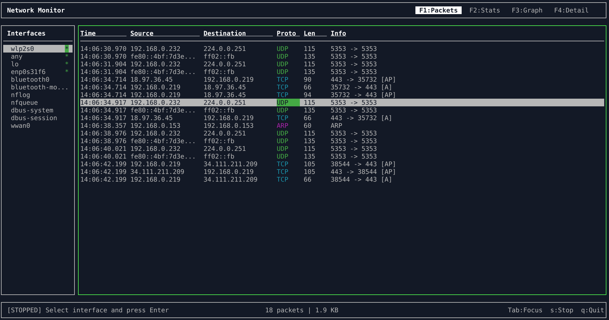

# Network Monitor

A terminal-based network traffic analyser built with C++20, ncurses, and libpcap. Monitor network traffic in real-time with an intuitive multi-panel interface.



## Features

### Multi-Panel Interface
Switch between views using F1-F4:

| Panel | Key | Description |
|-------|-----|-------------|
| Packets | F1 | Live scrollable list of captured packets with colour-coded protocols |
| Statistics | F2 | Packet counts, throughput rates, and protocol breakdown with visual bars |
| Graph | F3 | ASCII traffic graph showing packets/sec or bytes/sec over time |
| Detail | F4 | Full packet inspection with parsed headers and hex dump |

### Protocol Support
- **Layer 2**: Ethernet, ARP
- **Layer 3**: IPv4, IPv6, ICMP, ICMPv6
- **Layer 4**: TCP, UDP

### Hostname Extraction
Automatically extracts hostnames from:
- **DNS**: Query names (e.g., `google.com Query A`)
- **HTTP**: Host header and request path from unencrypted traffic
- **TLS/HTTPS**: Server Name Indication (SNI) from Client Hello messages

### Interface Selection
Browse and select network interfaces from the sidebar. Active interfaces are marked with an indicator.

## Building from Source

This project must be built from source. Pre-built binaries are not provided.

### Requirements

- CMake 3.16 or later
- C++20 compatible compiler:
  - GCC 10+ or
  - Clang 10+
- ncurses development library
- libpcap development library

### Install Dependencies

**Debian/Ubuntu:**
```bash
sudo apt install build-essential cmake libncurses-dev libpcap-dev
```

**Fedora:**
```bash
sudo dnf install gcc-c++ cmake ncurses-devel libpcap-devel
```

**Arch Linux:**
```bash
sudo pacman -S base-devel cmake ncurses libpcap
```

**macOS (with Homebrew):**
```bash
brew install cmake ncurses
# libpcap is included with macOS
```

### Compile

```bash
git clone https://github.com/arjy143/Network-Monitor.git
cd Network-Monitor
mkdir build && cd build
cmake ..
make
```

The compiled binary will be at `build/network-monitor`.

## Running

Packet capture requires elevated privileges. Choose one of these methods:

**Option 1: Run with sudo**
```bash
sudo ./build/network-monitor
```

**Option 2: Set capabilities (Linux only, recommended)**
```bash
sudo setcap cap_net_raw,cap_net_admin=eip ./build/network-monitor
./build/network-monitor
```

## Keyboard Controls

### Global Keys

| Key | Action |
|-----|--------|
| F1-F4 | Switch between panels |
| Tab | Toggle focus between sidebar and main panel |
| Up/Down | Navigate lists or scroll content |
| Enter | Select interface / Select packet for detail |
| s | Stop capture |
| q | Quit |

### Packet List (F1)

| Key | Action |
|-----|--------|
| a | Toggle auto-scroll |
| g / G | Jump to first / last packet |
| PgUp / PgDn | Page through packets |

### Graph (F3)

| Key | Action |
|-----|--------|
| b | Toggle between packets/sec and bytes/sec |

### Detail (F4)

| Key | Action |
|-----|--------|
| p | Parsed view (default) |
| h | Hex dump view |
| a | ASCII view |

## Testing

The project includes a unit test suite using the lightweight [attest.h](testing/attest.h) single-header testing framework.

### Running Tests

```bash
cd testing
g++ -std=c++20 -I../src tests.cpp ../src/packet.cpp ../src/config.cpp \
    ../src/descriptions.cpp ../src/watchlist.cpp -o test_runner -lpthread
./test_runner
```

### Test Options

| Option | Description |
|--------|-------------|
| `--list` | List all registered tests without running them |
| `--filter="pattern"` | Run only tests containing the pattern |
| `--json` | Output results in JSON format (useful for CI) |
| `--quiet` | Only show failures |

### Examples

```bash
./test_runner --filter=cidr     # Run only CIDR-related tests
./test_runner --json            # JSON output for CI pipelines
./test_runner --list            # List all 54 tests
```

## Project Structure

```
src/
  main.cpp              Entry point
  app.cpp/hpp           Application controller and event loop
  ui.cpp/hpp            ncurses wrapper with colour support
  capture.cpp/hpp       libpcap wrapper with background capture thread
  packet.cpp/hpp        Packet parsing (Ethernet, IP, TCP, UDP, DNS, HTTP, TLS)
  packet_store.cpp/hpp  Thread-safe packet storage with statistics
  sidebar.cpp/hpp       Interface selection widget
  panel.cpp/hpp         Base panel class
  panels/
    packet_list.cpp/hpp   Live packet list view
    stats.cpp/hpp         Statistics view with protocol breakdown
    graph.cpp/hpp         ASCII traffic graph
    detail.cpp/hpp        Packet detail and hex dump view
```

## Licence

This project is open source. See the repository for licence details.
