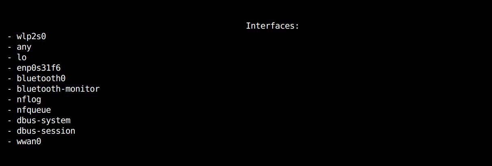
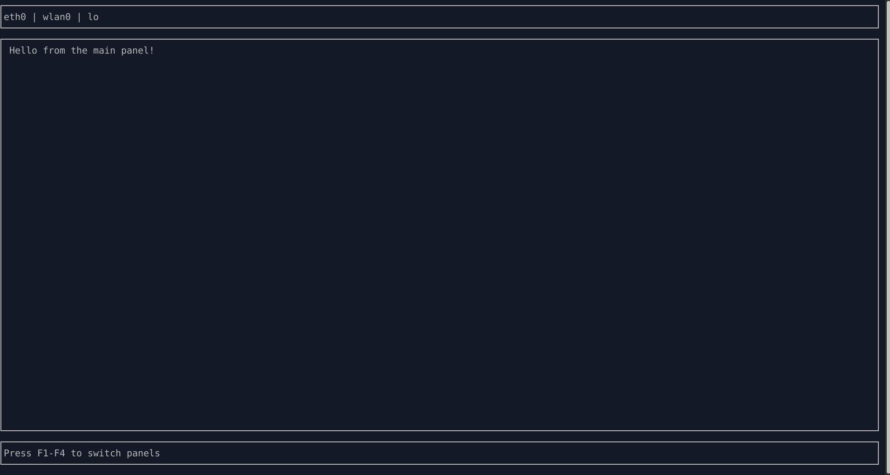

# 6/12/25

DONE:
- I now have a basic UI that shows the interfaces, and a basic layout

TODO:
- plan out the various pages. I'm thinking of a side bar that has selectable devices/interfaces, then the main section should have a continuously running list of packets, and maybe some graphs of how much traffic is going where.

- an idea of what the ui might be like:

